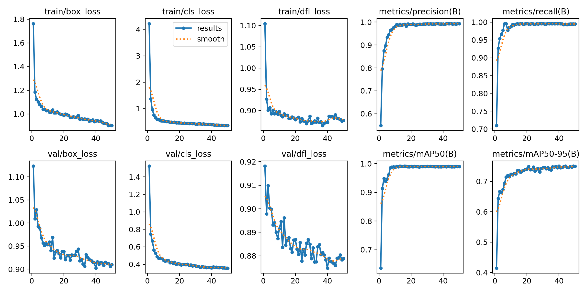
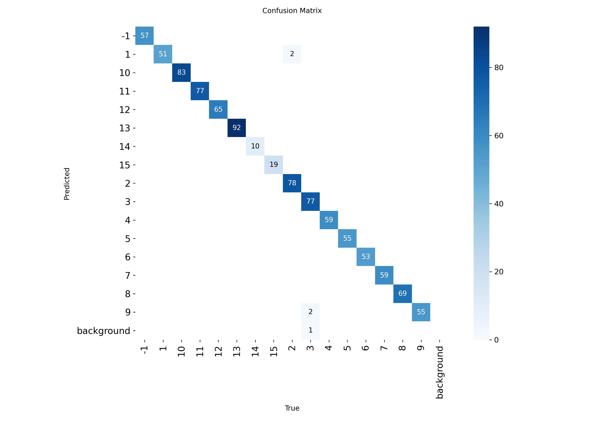

# Happily Struggle Against Landlords

## Overview
This project provides a DouDizhu assistant with YOLOv8-based card recognition.
It performs real-time detection on fixed screen regions and drives the AI helper.

## Changes
- Replaced template matching with YOLOv8 `best.pt` (weights: `weights/best.pt`)
- Expanded played-card regions to 600x600 with continuous detection
- UI shows live recognition results and YOLO inference latency
- Added debug mode with a mouse-following detection window
- Added region calibration with mouse boxing or manual input
- Calibration data stored at `config/regions.json`

## Training Results

## Usage
1. Run the game in windowed mode at 1920x1080.
2. Start the app with `python main.py`.
3. Click **Start** after your hand, bottom cards, and landlord role appear.
4. Follow the AI suggestion in-game manually.
5. Use **Stop** to end a round if recognition fails.
6. Use **Calibrate** to adjust regions if needed.

## Recognition Breakdown
YOLOv8-based detection:
- My hand cards
- Left/Right played cards
- Bottom (three landlord cards)

Template matching (original assets in `pics/`):
- Landlord flag (`pics/landlord_words.png`)
- Pass indicator (`pics/pass.png`)
- White background marker (`pics/white.png`)

## Notes
- The app relies on pixel-accurate regions. Calibrate if the window position changes.
- Visual effects during rocket (double jokers) can cause partial recognition.

## A lighthearted note
“Struggle against landlords” used to be a historical phrase, but on the card table it is just a game.
We only “struggle” with cards: one round, one laugh, and another shuffle.
